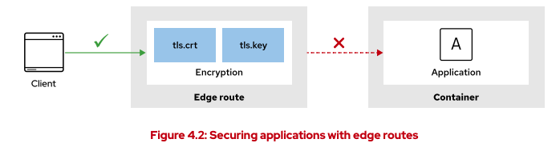
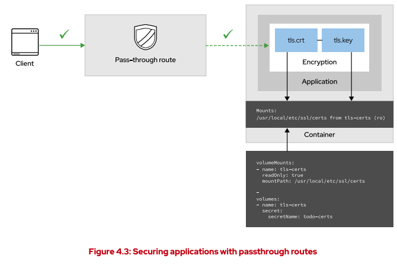

# Protect External Traffic with TLS

You can expose HTTP and HTTPS traffic, TCP applications, and also non-TCP traffic. Some of
these methods are service types, such as NodePort or load balancer, whereas others use their
own API resource, such as Ingress and Route.

## secure routes
Routes can be either secured or unsecured. Secure routes support several types of transport layer
security (TLS) termination to serve certificates to the client. Unsecured routes are the simplest to
configure, because they require no key or certificates. By contrast, secured routes encrypt traffic
to and from the pods.

## Default Router for OCP
Routes rely on a router plug-in to redirect the traffic from the public IP to pods. HAProxy. HTTP, HTTPS. (unsupporting MYSQL, Video Streaming)

## OpenShift Secure Routes


### Edge (on the router side, ocp handles the cert)

`oc create route edge --help`

`oc create route edge [NAME] --service=SERVICE [flags] [options]`



- TLS termination occurs at the router, before the traffic is routed to the pods. 
-  OpenShift assigns its own certificate to the router for TLS termination
- Because TLS is terminated at the router, connections from the router to the endpoints over the internal network are not encrypted.


```
# find the route for the default ingress router
oc get ingresscontrollers.operator.openshift.io -A
oc get ingresscontrollers.operator.openshift.io -n openshift-ingress-operator

# look at the YAML spec for the default router
oc get ingresscontrollers.operator.openshift.io default -n openshift-ingress-operator -o yaml

# look for the secret that holds the certificate
oc get secrets -A | grep classroom-tls 

# extract the secret subject
oc extract secret/classroom-tls -n openshift-ingress --to - | openssl x509 -in - -noout -issuer -subject

# create an edge route
oc create route edge \
 --service api-frontend --hostname api.apps.acme.com \
 --key api.key --cert api.crt

# curl the route
curl -I -v \
 https://todo-https.apps.ocp4.example.com

# watch the tcp traffic 
sudo tcpdump -i eth0 -A -n port 443 | grep "angular"
```

### Passthrough (on the app side)

`oc create route passthrough -h`

`oc create route passthrough [NAME] --service=SERVICE [flags] [options]`



- encrypted traffic is sent straight to the destination pod without TLS termination from the router.
-  the application is responsible for serving certificates for the traffic. 
-  currently the only method that supports mutual authentication between the application and a client that accesses it
- Network policies can help you to protect the internal traffic between your applications or between projects

#### How to generate certificates
You need certificates first...here's how

you create a key, you request a new signing request, you set  the subject of your cert, you set the signing authority who signed it, do you trust the authority

```
## Run the following command to create the private key

openssl genrsa -out training.key 4096

## Run the following command to generate a certificate signing request

openssl req -new \
  -subj "/C=US/ST=North Carolina/L=Raleigh/O=Red Hat/CN=todo-https.apps.ocp4.example.com" \
  -key training.key -out training.csr

## Run the following command to generate a certificate

openssl x509 -req -in training.csr \
  -passin file:passphrase.txt \
  -CA training-CA.pem -CAkey training-CA.key -CAcreateserial \
  -out training.crt -days 1825 -sha256 -extfile training.ext

# you have to protect the training.key in a vault

# Create the cert with the training.cert and training.key with a secret
oc create secret -h
oc create secret tls -h
oc create secret tls NAME --cert=path/to/cert/file --key=path/to/key/file [--dry-run=server|client|none] [options]

# you have to update your application where to look for the cert and key
# you have to redeploy the app to use SSL

# Create the passthrough route to the hostname set in the CN
oc create route passthrough todo-https --service=todo-https --port 8443 --hostname todo-https.apps.ocp4.example.com
```

### Re-encrypt
- Re-encryption is a variation on edge termination, whereby the router terminates TLS with a
certificate, and then re-encrypts its connection to the endpoint, which might have a different
certificate
- the full path of the connection is encrypted, even over the internal network. The router uses health checks to determine the authenticity of the host.

# Configure Network Policies
In contrast to traditional firewalls, Kubernetes network policies control network traffic between
pods by using labels instead of IP addresses. To manage network communication between pods
in two namespaces, assign a label to the namespace that needs access to another namespace,
and create a network policy that selects these labels. 

In network policies, use selectors
under spec to assign which destination pods are affected by the policy, and selectors under
spec.ingress to assign which source pods are allowed.

`oc explain networkpolicy`

`oc explain networkpolicy.spec`

`oc explain networkpolicy.spec.podSelector`

 *only allow traffic*
#punchingholes
*done by developers*

https://docs.openshift.com/container-platform/4.12/networking/network_policy/about-network-policy.html

## First you create a deny-all networkpolicy

This will fail pod to pod network in the same namespace
```
kind: NetworkPolicy
apiVersion: networking.k8s.io/v1
metadata:
 name: deny-all
spec:
 podSelector: {}
```

Only allow connections from the OpenShift Container Platform Ingress Controller
```
apiVersion: networking.k8s.io/v1
kind: NetworkPolicy
metadata:
  name: allow-from-openshift-ingress
spec:
  ingress:
  - from:
    - namespaceSelector:
        matchLabels:
          network.openshift.io/policy-group: ingress
  podSelector: {}
  policyTypes:
  - Ingress
```

Only allow HTTP and HTTPS traffic based on pod labels
```
kind: NetworkPolicy
apiVersion: networking.k8s.io/v1
metadata:
  name: allow-http-and-https
spec:
  podSelector:
    matchLabels:
      role: frontend
  ingress:
  - ports:
    - protocol: TCP
      port: 80
    - protocol: TCP
      port: 443
```

Accept connections by using both namespace and pod selectors:
```
kind: NetworkPolicy
apiVersion: networking.k8s.io/v1
metadata:
  name: allow-pod-and-namespace-both
spec:
  podSelector:
    matchLabels:
      name: test-pods
  ingress:
    - from:
      - namespaceSelector:
          matchLabels:
            project: project_name
        podSelector:
          matchLabels:
            name: test-pods
```


# Protecting Internal Traffic with TLS

Zero-trust environments assume that every interaction begins in an untrusted state. Users can access only files or objects that are specifically allowed; communication must be encrypted; and client applications must verify the authenticity of servers.

By default, OpenShift encrypts network traffic between nodes and the control plane, and prevents
external entities from reading internal traffic. This encryption provides stronger security than
default Kubernetes, which does not automatically encrypt internal traffic. Although the control
plane traffic is encrypted, applications in OpenShift do not necessarily verify the authenticity of
other applications or encrypt application traffic.

## OCP Service CA Operator

OpenShift provides the service-ca controller to generate and sign service certificates for
internal traffic. The service-ca controller creates a secret that it populates with a signed
certificate and key. A deployment can mount this secret as a volume to use the signed certificate.
Additionally, client applications need to trust the service-ca controller CA.

To generate a certificate and key pair, apply the service.beta.openshift.io/servingcert-secret-name=your-secret annotation to a service. The service-ca controller creates
the your-secret secret in the same namespace if it does not exist, and populates it with a
signed certificate and key pair for the service.

After OpenShift generates the secret, you must mount the secret in the application deployment.
The location to place the certificate and key is application-dependent. 

https://github.com/openshift/service-ca-operator/blob/master/README.md

https://docs.openshift.com/container-platform/4.12/service_mesh/v2x/ossm-architecture.html

https://access.redhat.com/documentation/en-us/openshift_container_platform/4.12/html-single/security_and_compliance/index#add-service-serving

you apply this on the service, so you must have a service

### Debug issue

```
# debug the pod, but issues maybe caused outside
oc debug pod

# debug the deployment for a greater view
oc debug deployment.app

```

### Annotating a service with a certificate and generating a secret

``

```
# generate the x509 crt and secret (it will be signed by an authority no one will trust)
oc annotate service server service.beta.openshift.io/serving-cert-secret-name=server-secret

# (optional) extract the files locally
oc extract secret/server-secret

# (optional) view the local .crt
openssl x509 -in tls.crt -noout -text

# mount the cert in the application
oc set volume deployment/server --add --name server-secret --secret-name server-secret --mount-path /etc/pki/nginx

# explain the deployment spec
oc explain deployment.spec.template.spec


# remove the revision
# you can use the items optional field to set the crt and key in different paths
 82       - name: server-secret
 83         secret:
 84           defaultMode: 420
 85           secretName: server-secret
 86           items:
 87             - key: tls.crt
 88               path: server.crt
 89             - key: tls.key
 90               path: private/server.key

 # test the encrpytion
 oc rsh pod/name
 cat /etc/resolv.conf
 openssl s_client -connect server.network-svccerts.svc:443

# Add the service CA bundle to a config map
https://access.redhat.com/documentation/en-us/openshift_container_platform/4.12/html-single/security_and_compliance/index#add-service-certificate-configmap_service-serving-certificate

# create a any configmap
oc create configmap ca-bundle

# annotate the new configmap and inject the CA bundle with the same CA that signed our svccert
oc annotate cm ca-bundle service.beta.openshift.io/inject-cabundle=true

# update the app with the paths for the cert

# inspect the ca bundle
oc describe cm ca-bundle 
```