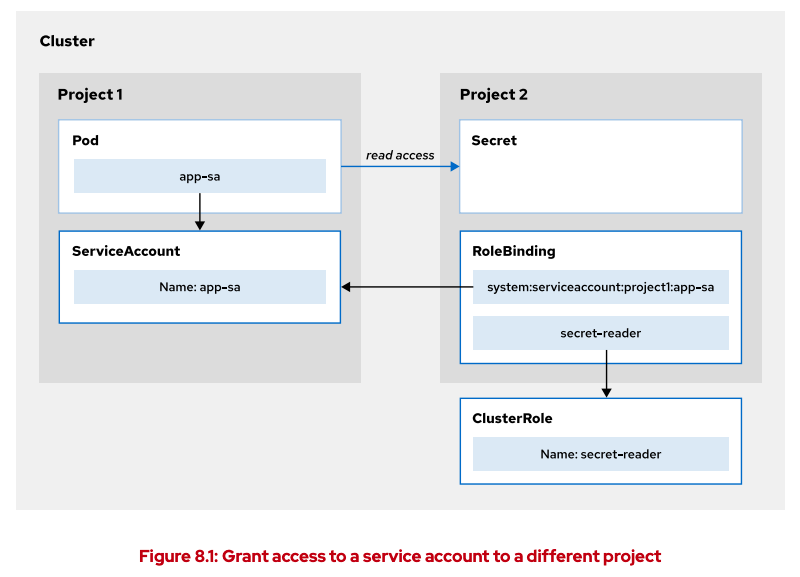

# Security Context Constraints (SCC)

Red Hat OpenShift provides security context constraints (SCCs), a security mechanism that limits
the access from a running pod in OpenShift to the host environment. SCCs control the following
host resources:
• Running privileged containers
• Requesting extra capabilities for a container
• Using host directories as volumes
• Changing the SELinux context of a container
• Changing the user ID

Cluster administrators can run the following command to list the SCCs that OpenShift defines:
`oc get scc`

OpenShift provides the following default SCCs:
• anyuid
• hostaccess
• hostmount-anyuid
• hostnetwork
• node-exporter
• nonroot
• privileged
• restricted

For additional information about an SCC, use the oc describe 

Most pods that OpenShift creates use the restricted SCC, which provides limited access to resources that are external to OpenShift

To change the container to run with a different SCC, you must create a service account that is bound to a pod.

To associate the service account with an SCC, use the oc adm policy command. Identify a
service account by using the -z option, and use the -n option if the service account exists in a
different namespace from the current one

https://cloud.redhat.com/blog/managing-sccs-in-openshift

```
# what SCC do we have
oc get scc -o name -A

# previously, what did we allow in the runtime
oc decsribe scc restricted 

# what do we allow in v2 -- THIS IS THE MOST SECURE SCC (DEFAULT)
oc describe scc restricted-v2

# Use the oc create serviceaccount command to create the service account, and use the -n option if the service account must be created in a different namespace from the
oc create serviceaccount service-account-name

# associate the service account
oc adm policy add-scc-to-user SCC -z service-account

# Change an existing deployment or deployment configuration to use the service account by using
the oc set serviceaccount command
oc set serviceaccount deployment/deployment-name service-account-name
```

## Example deploy gitlab community edition in OCP
```
# create a project
oc new-project

# review the project scc
# note the kubernetes.io label for pod admission; in K8s there are only 3 levels of policies (restricted, baseline, priveleged); k8s has no scc
oc get project appsec-scc -o yaml

# create a new-app
oc new-app --name gitlab --image registry.ocp4.example.com:8443/redhattraining/gitlab-ce:8.4.3-ce.0 --dry-run -o yaml > gitlab-app
oc new-app --name gitlab --image registry.ocp4.example.com:8443/redhattraining/gitlab-ce:8.4.3-ce.0

# check the status
oc get all

# check the events
oc get events

# check the pod
oc descrive pod/gitlab-HASH
oc logs pod/gitlab-HAS

# can you reproduce the error manually?
oc get deployment
oc debug deployment/gitlab
> env
> whoami
> id
> ls -ld
> chwon root:root /etc/gitlab
> chmod 0775 /etc/gitlab
# you don't own the file to change the owner or permissions
# we need to give chef more permissions to do this

# notice the supplemental groups and unique uid ranges for the project that all apps are forced to run as
# these ranges are unique for each project
oc get project appsec-scc -o yaml

# as admin check the scc restricted-v2
# note the Run As User Strategy: MustRunAsRange
oc describe scc restricted-v2
# get the scc, look for the RUNASUSER column to RunAsAny
# the MustRunAsRange will require the scc annotation on project that is always different
oc get scc 

# remember restricted-v2 (default), anyuid (allow anyuser), priveleged (root)
oc get scc -o name

# check your existing serviceaccounts (defaults == builder, default, deployer )
oc get serviceaccounts

KNOW THIS!!!!!
# 1) create new service account no one is using; this will match the default sa
oc create serviceaccount gitlab-sa

# 2) so, create a rolebinding to the new service account in your desired namespace as ADMIN
oc adm policy add-scc-to-user
oc adm policy add-scc-to-user anyuid -z gitlab-sa -n appsec-scc

# 3) attach the serviceaccount to the deployment 
oc set serviceaccount deployment/gitlab gitlab-sa

# remotesh to the pod and check user
oc rsh pod/gitlab-6dcb5457df-lvl9z
> whoami
> id

# expose the service to get the route
oc expose service/gitlab --port 80 --hostname gitlab.app.ocp4.example.com

```

# Allow Application Access to Kubernetes APIs
With the Kubernetes APIs, a user or an application can query and modify the cluster state.
To protect your cluster from malicious interactions, you must grant access to the different
Kubernetes APIs.
Role-based access control (RBAC) authorization is preconfigured in OpenShift. An application
requires explicit RBAC authorization to access restricted Kubernetes APIs.

## Accessing API Resources in the Same Namespace
1. To grant an application access to resources in the same namespace, you need a role or a cluster
role and a service account in that namespace. 
1. You then create a role binding that associates to the
service account the actions that the role grants on the resource. 
1. Using a role binding with a cluster
role grants access only to the resource within the namespace.

## Accessing API Resources in a Different Namespace

1. To give an application access to a resource in a different namespace, you must create the role
binding in the project with the resource. 
1. The subject for the binding references the application
service account that is in a different namespace from the binding.

https://github.com/stakater/Reloader



```
# you have to use extended context to grant permissions from one proj to another
oc policy add-role-to-user system:serviceaccount:configmap-reloader:configmap-reloader
# check what you did
oc get rolebindings -o wide
```

# Cluster and Node Maintenance with Kubernetes Cron Jobs

deployment is meant to be an application that persists. not a one and done thing.
there are situations you don't want it to run fovever.

You can automate tasks in OpenShift by using standard Kubernetes jobs and cron jobs. The
automated tasks can be configured to run once or on a regular schedule.

## K8s job

The job resource includes a pod template that describes the task to execute. You can use the oc
create job --dry-run=client command to get the YAML representation of the Kubernetes
job resource:

```
oc create job --dry-run=client -o yaml test \
 --image=registry.access.redhat.com/ubi8/ubi:8.6 \
 -- curl https://example.com

 # create a batch job called apitest
 oc create job apitest --image=registry.access.redhat.com/uib9/uib -- curl -k https://kuberntes.default

oc create job apitest1 --image=registry.access.redhat.com/ubi9/ubi -- curl -k https://kubernetes.default/.well-known/oauth-authorization-server

wget https://raw.githubusercontent.com/ajblum/do180NG-sa/main/Chapters/CH4/Resources/healthz.yaml

# placement of the -o yaml
oc create job apitest1 --image=registry.access.redhat.com/ubi9/ubi --dry-run=client -o yaml -- curl -k https://kubernetes.default/.well-known/oauth-authorization-server
```

## Cron job

how to clean images in openshift 
https://cloud.redhat.com/blog/image-garbage-collection-in-openshift


```

cat /etc/crontab
```